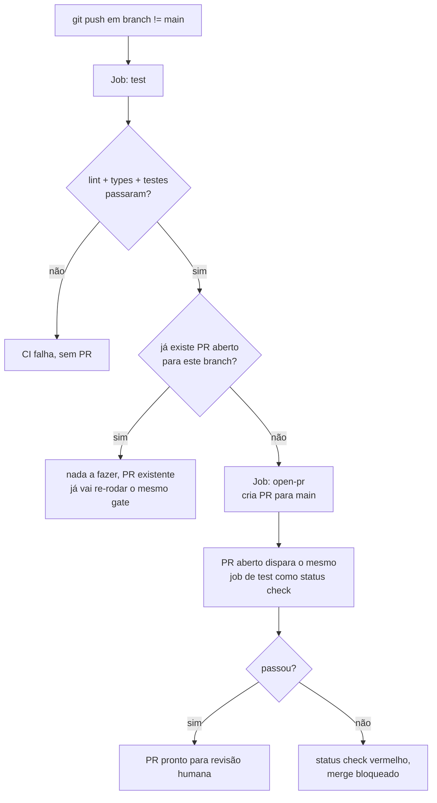

# 07 — Fluxo de Qualidade: Skills e CI/CD

Este documento cobre duas coisas que não vêm do diagrama: **quais skills o Claude Code deve
carregar em cada tipo de tarefa**, e **como o pipeline de CI/CD funciona**. Ambas são
**[DECIDIDO]** pelo time, registradas em ADR-012 e ADR-013 (`04-decisoes-tecnicas.md`).

## Skills por tipo de tarefa

| Tarefa | Skills, nesta ordem | Momento |
|---|---|---|
| Qualquer componente, tela ou fluxo em React (`apps/frontend/`) | `frontend-design` → `react-expert` → `ui-ux-prox-max` | Antes de escrever o código |
| Qualquer módulo Python (`apps/ms_*`, `apps/lambda_*`, `packages/`) | `fullstack-dev-skills` | Antes de escrever o código |
| Fim de **qualquer** tarefa de desenvolvimento, frontend ou backend | `security-guidance` → `code-review` | Depois do código escrito, antes de dar a tarefa por concluída |

Regras de uso:

- As skills de início de tarefa (`frontend-design`/`react-expert`/`ui-ux-prox-max` ou
  `fullstack-dev-skills`) são carregadas **antes** da primeira linha de código, não depois —
  elas informam decisões de estrutura que são caras de desfazer depois de escritas.
- `security-guidance` roda **antes** de `code-review`, sempre. Uma correção de segurança pode
  alterar trechos que o code review ainda vai examinar; rodar na ordem inversa faz o code review
  revisar código que está prestes a mudar.
- Uma tarefa que mistura frontend e backend (ex.: um endpoint novo + a tela que o consome) usa
  as skills de ambos os lados antes de escrever qualquer código, e a dupla
  `security-guidance`/`code-review` roda uma vez no fim, sobre o conjunto completo da mudança —
  não uma vez por lado.
- Nenhuma tarefa é considerada concluída sem `security-guidance` e `code-review` terem rodado.
  Isso vale mesmo para mudanças pequenas — a skill decide se há algo a apontar, não o
  desenvolvedor antecipadamente.

Este projeto não define o conteúdo dessas skills — elas vêm do catálogo do Claude Code do time.
Se alguma não estiver disponível na sessão, pare e avise em vez de prosseguir sem ela.

## Pipeline de CI/CD

Objetivo: todo `push` roda o gate de qualidade sozinho, e todo branch pronto vira PR sem passo
manual.



Dois gatilhos, um workflow:

1. **`push` em qualquer branch ≠ `main`** → roda testes → se verde e não existir PR para o
   branch, abre um PR para `main`.
2. **`pull_request` contra `main`** → roda os mesmos testes como *status check* obrigatório.

O job de teste é o mesmo nos dois gatilhos — a criação automática do PR não é o gate de
qualidade, é só o que elimina o clique manual de "abrir PR". O gate de verdade é o status check
no PR, que qualquer atualização do branch faz rodar de novo.

### `.github/workflows/ci.yml`

```yaml
name: CI

on:
  push:
    branches-ignore: [main]
  pull_request:
    branches: [main]

concurrency:
  group: ci-${{ github.workflow }}-${{ github.ref }}
  cancel-in-progress: true

jobs:
  test-backend:
    runs-on: ubuntu-latest
    services:
      ministack:
        image: ministackorg/ministack
        ports:
          - 4566:4566
        options: >-
          --health-cmd "curl -f http://localhost:4566/_localstack/health || exit 1"
          --health-interval 5s --health-timeout 3s --health-retries 12
    steps:
      - uses: actions/checkout@v4

      - name: Instalar uv
        uses: astral-sh/setup-uv@v3
        with:
          enable-cache: true

      - name: Instalar dependências Python
        run: uv sync --all-packages --dev

      - name: Lint (ruff)
        run: uv run ruff check .

      - name: Formatação (ruff format --check)
        run: uv run ruff format --check .

      - name: Tipos (mypy --strict)
        run: uv run mypy --strict apps packages

      - name: Testes unitários
        run: uv run pytest tests/unit -v

      - name: Aguardar MiniStack
        run: |
          for i in $(seq 1 20); do
            curl -sf http://localhost:4566/_localstack/health && break
            sleep 2
          done

      - name: Provisionar recursos no MiniStack
        run: ./scripts/init-aws.sh
        env:
          AWS_ENDPOINT_URL: http://localhost:4566
          AWS_ACCESS_KEY_ID: test
          AWS_SECRET_ACCESS_KEY: test
          AWS_DEFAULT_REGION: us-east-1

      - name: Testes de integração
        run: uv run pytest tests/integration -v
        env:
          AWS_ENDPOINT_URL: http://localhost:4566
          AWS_ACCESS_KEY_ID: test
          AWS_SECRET_ACCESS_KEY: test
          AWS_DEFAULT_REGION: us-east-1
          GEMINI_MODE: fake

  test-frontend:
    runs-on: ubuntu-latest
    defaults:
      run:
        working-directory: apps/frontend
    steps:
      - uses: actions/checkout@v4

      - uses: actions/setup-node@v4
        with:
          node-version: "22"
          cache: npm
          cache-dependency-path: apps/frontend/package-lock.json

      - run: npm ci
      - run: npm run lint
      - run: npm run typecheck
      - run: npm run test -- --run
      - run: npm run build

  open-pr:
    needs: [test-backend, test-frontend]
    if: github.event_name == 'push' && github.ref != 'refs/heads/main'
    runs-on: ubuntu-latest
    permissions:
      contents: read
      pull-requests: write
    steps:
      - uses: actions/checkout@v4

      - name: Abrir PR se ainda não existir
        env:
          GH_TOKEN: ${{ secrets.GITHUB_TOKEN }}
        run: |
          BRANCH="${GITHUB_REF#refs/heads/}"
          EXISTING=$(gh pr list --head "$BRANCH" --base main --state open --json number --jq 'length')
          if [ "$EXISTING" -gt 0 ]; then
            echo "Já existe PR aberto para $BRANCH, nada a fazer."
            exit 0
          fi
          gh pr create \
            --base main \
            --head "$BRANCH" \
            --title "$(git log -1 --pretty=%s)" \
            --body "PR aberto automaticamente após testes verdes em \`$BRANCH\`. Revisão humana pendente — lembre de conferir se \`security-guidance\` e \`code-review\` já rodaram sobre esta mudança."
```

### Notas sobre o workflow

- **`services.ministack`** só suporta as opções simples do GitHub Actions (imagem, portas,
  healthcheck) — por isso os recursos (filas, DLQs, tabela, segredo) são criados por um passo
  explícito que roda `scripts/init-aws.sh` (o mesmo script do ambiente local, ver
  `06-ambiente-local.md`), em vez de depender do mecanismo de init script do MiniStack.
- **`GEMINI_MODE: fake`** — o CI nunca chama o Gemini de verdade. Não há chave de API no
  workflow, então não há custo nem dependência de rede externa no pipeline.
- **`concurrency`** cancela execuções antigas do mesmo branch quando um novo push chega, para
  não gastar minutos de CI em código já superado.
- **`open-pr` só roda em `push`**, nunca em `pull_request` — senão o PR tentaria abrir a si
  mesmo a cada atualização.
- O PR criado automaticamente **não é aprovado automaticamente**. Ele só existe; a revisão
  humana — incluindo conferir se as skills `security-guidance` e `code-review` já rodaram sobre
  a mudança — continua obrigatória antes do merge.
- Para o gate funcionar de verdade (bloquear merge com CI vermelho), configure branch protection
  em `main` exigindo o status check `test-backend` e `test-frontend` — isso é feito uma vez nas
  configurações do repositório, não faz parte do YAML.

### Scripts referenciados

`scripts/init-aws.sh` é o mesmo do ambiente local (`docs/06-ambiente-local.md`) — cria as três
filas com DLQ, a tabela DynamoDB e o segredo fake do Gemini. Mantenha os dois usos (dev local e
CI) apontando para o mesmo script, para não haver dois lugares definindo os mesmos recursos de
formas ligeiramente diferentes.
